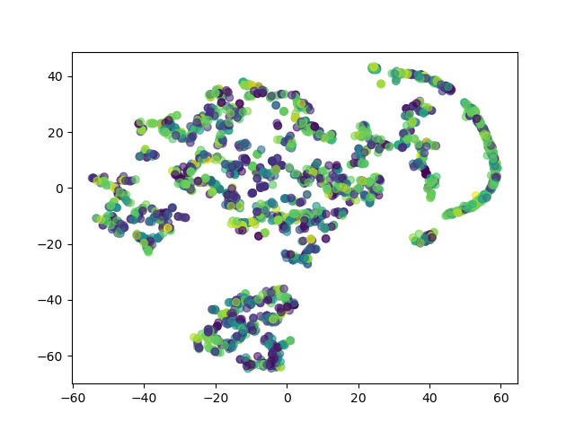

# POMEGRANATE

[](https://opensource.org/licenses/MIT)

**P**h**o**sphosite **m**otif **e**xplorer -- **gra**ph **n**etwork **a**bstraction **t**hrough **e**mbeddings 

Pomegranate interactively explores phosphosite motifs on protein structures through a web application. 

Clustering of protein graphs is also possible through a command line interface.


### AF2 Structure database


Alternative databases are also supported.  

Local PDB files can also be used (IN PROGRESS)

### Structural motif clustering 

[Compressed proteome downloads](https://alphafold.ebi.ac.uk/download) 


Currently using *[Saccharomyces cerevisiae](https://ftp.ebi.ac.uk/pub/databases/alphafold/latest/UP000002311_559292_YEAST_v2.tar)*  \
and *[Homo sapiens](https://ftp.ebi.ac.uk/pub/databases/alphafold/latest/UP000005640_9606_HUMAN_v2.tar)*

Other bulk-download options can be found [here](https://alphafold.ebi.ac.uk/download).

### Extract structural motif for a given radius


## Installation 

TODO: upload to PyPI

### Dependencies

```
pip install graphein 
pip install dash

# DSSP 
conda install -c salilab dssp
# or 
sudo apt-get install dssp
```

### Dependencies

```
pip install graphein 
pip install dash

# DSSP 
conda install -c salilab dssp
# or 
sudo apt-get install dssp
```


## Usage 

### Clustering pipeline 

#### Load and download PDB files using phosphosite database


```
$ pomegranate load --help
Usage: pomegranate load [OPTIONS] PHOSPHOSITE STRUCTURES GRAPHS

Options:
  -v, --verbose                   Show extensive program output.
  -d, --debug                     Show extensive program output for debugging.
  -q, --quiet                     Suppress program output.
  -n, --dry-run, --dryrun         Print out what the program would do without
                                  loading the graphs.
  -u, --unique                    Only construct graphs for unique motifs.
                                  Duplicate entries (i.e. with different
                                  kinases) are ignored.
  --download / -S, --skip-download
                                  Skip downloading protein structures into the
                                  supplied directory.  If the required
                                  structure does not exist, graph construction
                                  for that accession ID will be skipped.
  -o, --graph-format, --output-format, --format [NetworkX|StellarGraph|nx|sg]
                                  Save graphs as NetworkX or StellarGraph
                                  instances with feature preprocessing.
                                  [default: NetworkX]
  -N, --num-psites INTEGER        Only consider the first N motifs in a
                                  dataset.  Graph construction will continue
                                  until N graphs are made, or the end of the
                                  dataset is reached.
  -r, --radius FLOAT              The threshold radius of the motif  [default:
                                  10.0]
  --rsa, --rsa-threshold FLOAT    The RSA threshold of the motif  [default:
                                  0.0]
  --node-features, --nf <node_features>
                                  Which node features to include in the
                                  constructed graphs.  [default:
                                  m1,m2,m3,m4,m5,m6,m7pdist,coords,bfac,rsa]
  --edge-features, --ef TEXT
  -c, --config TEXT               Path to config.yml file used to specify how
                                  to construct the graphs.  [default:
                                  config.yml]
  --help                          Show this message and exit.
```

#### Learn protein representations 

```
Usage: cluster_graphs.py [OPTIONS] GRAPHS SAVEPATH

Options:
  --train-method [graph|node]  Method to use for training the graph neural
                               network.  [default: graph]
  -e, --epochs INTEGER         Number of epochs to train for.  [default: 50]
  -b, --batch-size INTEGER     Batch size to be used by data generator.
                               [default: 16]
  -N, --num-graphs INTEGER
  -v, --verbose
  --write-csv, --csv
  --help                       Show this message and exit.
```

TODO: have multiple models to use for clustering with different training methods associated with each. 

E.g. 

- GCN trained on graph-graph distance; 
- node classification layer (semi-supervised)
etc.

#### Visualise 

```
Usage: visualise_embeddings.py [OPTIONS] EMBEDDINGS OUTDIR

Options:
  -N, --num-plots INTEGER         How many plots to output.  [default: 1]
  --dim-method, --method [UMAP|tSNE|PCA]
                                  Method to use for dimensionality reduction.
                                  [default: tSNE]
  -l, --labels / --no-labels      Show labels on plot.
  -i, --interactive               Open interactive plot viewer.
  -v, --verbose
  --help                          Show this message and exit.
```

Example clustering:



#### Cluster embeddings

##### TODO

Hierarchical, k-means, etc.


## References

## Screenshots

(From left --> right & up --> down) Tab selection, Protein searchbars, Adjacency matrix, Radius & RSA sliders, Asteroid plot, Phosphorylation site selection, Matrix order dropdown, 


(From left --> right & up --> down) Tab selection, Protein searchbars, Radius slider, Matrix Order dropdown, Grayscale dropdown, Phosphosite selection bar, Adjacency matrices


Help Page
